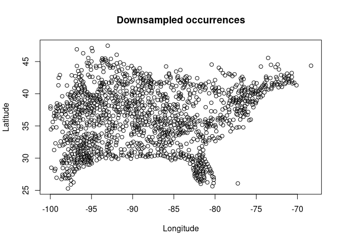
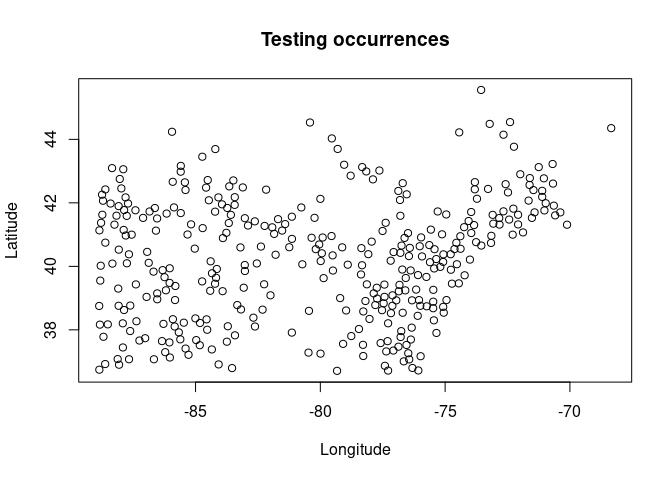
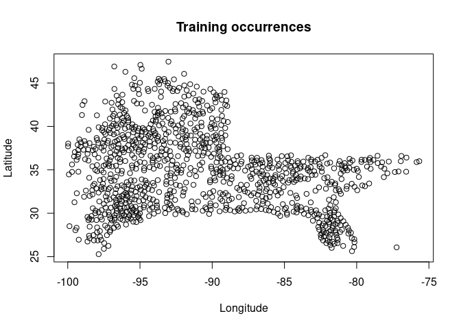
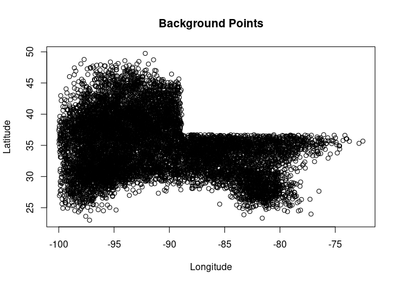
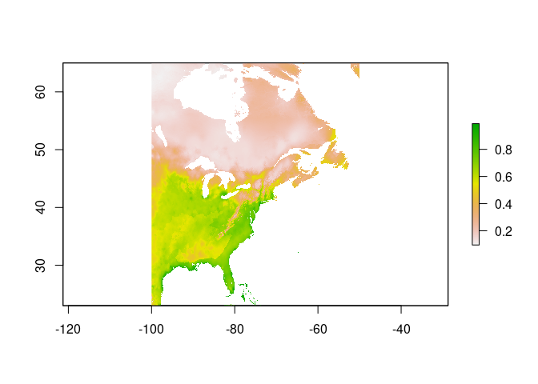
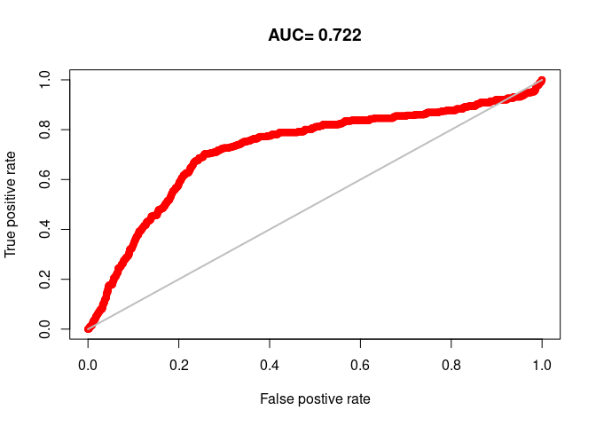
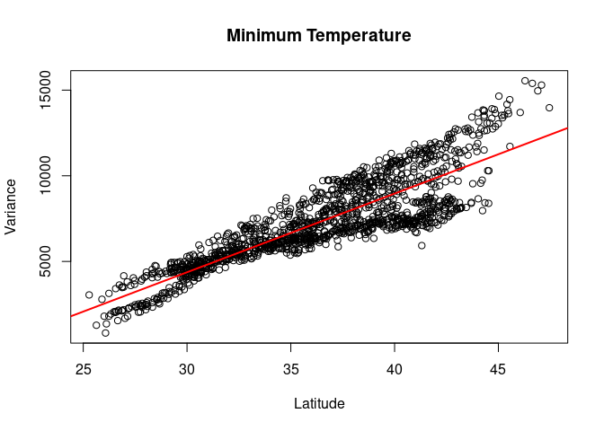
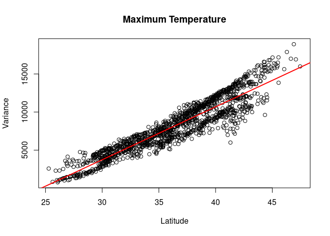
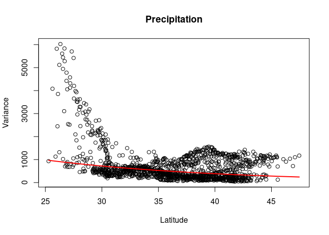

```r
#module load R
#export R_LIBS_USER=~/R_Lib/3.5.1-foss-2018a-X11-20180131
```


```r
load("~/Desktop/cham_sdm_plotdata3.Rdata")

#just so the markdown will knit with ROC image
library(raster)
```

```
## Loading required package: sp
```

```r
library(dismo)
```


Because this model will include Canada, I am going to use WorldClim data, rather than Prism which only includes the United States of America.

# Loading Environmental Data

```r
#load libraries
library(raster)

#Download BioClim variables
bio <- getData("worldclim", var="bio", res="2.5")

#Drop Bio3 and Bio7 because they are generated from other bioclim variables
bio <- dropLayer(bio, c(3,7))

#creat study extent
study <- extent(-100, -50, 23, 65)

#Crop Bioclim layers to extent of 100th parallel
eastc <- crop(bio, study)
```

# Prepping Occurrence data
I redownloaded GBIF data to make sure I included occurrence points in Canada. The polygon used: POLYGON((-123.39844 6.3153,-46.75781 6.3153,-46.75781 72.39571,-123.39844 72.39571,-123.39844 6.3153))

GBIF.org (11 March 2021) GBIF Occurrence Download https://doi.org/10.15468/dl.wtf7kj

```r
#necessary libraries
library(sp)
library(dismo)
library(rJava)
```


```r
# load all occurrence data
obs <- read.delim("/mnt/scratch/wils1582/maxent_mod/cham_sdm/cham_fas2.csv")

#obs <- read.delim("~/Desktop/chamaecrista_fasiculata_occr.csv")
```


```r
# coerce the latitude and longitude columns to be numeric
obs$decimalLatitude <- as.numeric(obs$decimalLatitude)
obs$decimalLongitude <- as.numeric(obs$decimalLongitude)

# Only keep necessary columns
obs <- subset(obs, select=c("decimalLatitude", "decimalLongitude"))

# get rid of GBIF observations without location information
datedat <- subset(obs, !is.na(decimalLongitude) & !is.na(decimalLatitude))

#rename the columns
names(datedat) <- c("latitude","longitude")
```

I remove duplicate observations with matching coordinates (in latitude and longitude).


```r
# find duplicate observations
obsdups<-duplicated(datedat[, c("longitude", "latitude")])

# eliminate duplicate observations
datedat <-datedat[!obsdups, ]
```

I crop occurrences to only be inside the raster

```r
#convert the raster layer to a spatial polygon data frame
spdf <- as(eastc[[1]], 'SpatialPolygonsDataFrame')

#only pull location from the dataframe of observations
locations <- cbind.data.frame(datedat$longitude, datedat$latitude)

#rename the columns
names(locations) <- c("longitude", "latitude")

#code columns as spatial coordinates to create a spatial object
coordinates(locations) <- ~longitude+latitude

#match the CRS of both spatial objects
proj4string(locations) <- CRS(proj4string(spdf))

#define which points are within the spatial polygon data frame
points_in <- over(locations, spdf)

#peak at the data; rows with NA are not inside USA
head(points_in)

#tack information back onto occurrence point dataframe
obs_in <- cbind(datedat, points_in)

#drop rows with NA in any column (will be NAs in 'points_in' column)
obs_in <- na.omit(obs_in)

#grab location data
obs_final <- subset(obs_in, select=c("longitude", "latitude"))
```

I am downsampling occurrences to be no closer than 200km apart, as outlined in Lake et. al. 2020.

```r
downsample_usa_location <- function(observations) {
  library(rgeos)
  
  # Create coordinates and sp object
  coordinates(observations) <- ~longitude+latitude

  # Set the CRS of the sp object
  proj4string(observations) <- CRS("+proj=longlat +datum=WGS84 +ellps=WGS84 +towgs84=0,0,0")

  # Transform to the correct projection that allows for distance calculation (the north american projection)
  observations <- spTransform(observations, CRS("+proj=laea +lat_0=45 +lon_0=-100 +x_0=0 +y_0=0 +ellps=WGS84 +units=m +no_defs"))

  # Create a matrix with binary TRUE/FALSE if points are within 70km of one another
  obs_matrix <- gWithinDistance(observations, dist=20000, byid = TRUE)

  # Set the lower triangle and diagonal as NAs
  obs_matrix[lower.tri(obs_matrix, diag=TRUE)] <- NA

  # Use column sum to remove ones with NAs; v is a logical vector
  v <- colSums(obs_matrix, na.rm=TRUE) == 0

  # Subset the points in V from the spatial points dataset by row
  obs_eu_t <- observations[v, ]

  # reproject to latitude and longitude
  obs_eu_t <- spTransform(obs_eu_t, CRS("+proj=longlat +datum=WGS84 +ellps=WGS84 +towgs84=0,0,0"))

  #reset the CRS
  proj4string(obs_eu_t) <- CRS("+proj=longlat +datum=WGS84 +ellps=WGS84 +towgs84=0,0,0")

  # Save coordinates as matrix
  obs_ds <- obs_eu_t@coords

  return(obs_ds)
}

ds_obs <- downsample_usa_location(obs_final)

ds_obs <- as.data.frame(ds_obs)
```


```r
#plot points
plot(ds_obs$longitude, ds_obs$latitude, xlab= "Longitude", ylab="Latitude", main = "Downsampled occurrences")
```

<!-- -->
Looks good.

Partitioning into testing and training observations.

```r
#testing observations in the upper right of USA
test_obs <- ds_obs[which((ds_obs$latitude > median(ds_obs$latitude)) & (ds_obs$longitude > median(ds_obs$longitude))), ]

#Training observations the remaining 75% of occurrences
train_obs <- ds_obs[which((ds_obs$latitude < median(ds_obs$latitude)) | (ds_obs$longitude < median(ds_obs$longitude))), ]
```


```r
plot(test_obs$longitude, test_obs$latitude, xlab= "Longitude", ylab="Latitude", main = "Testing occurrences")
```

<!-- -->


```r
plot(train_obs$longitude, train_obs$latitude, xlab= "Longitude", ylab="Latitude", main = "Training occurrences")
```

<!-- -->


```r
#KDE generation
gauss_kde <- function(observations) {
  # Load package
  library(ks)
  #Find Bandwidth
  H <- Hpi.diag(observations)
  # Run Kernal Density Estimation
  kde <- kde(observations, H = H)
  # Random draw 25000 points from truncated Kernel Density Estimation
  bg <- as.data.frame(rkde(25000, kde, positive = FALSE))
  #remove points that are within the witheld area
  bg <- bg[which((bg$latitude < median(ds_obs$latitude)) | (bg$longitude < median(ds_obs$longitude))), ]
  #remove things to the left og 100th parallel
  bg<-bg[!(bg$longitude < -100),]
  #take random draw of 10,000 points
  bg <- bg[sample(nrow(bg), 10000), ]
  return(bg)
}

bg_points <- gauss_kde(train_obs)
```


```r
plot(bg_points$longitude, bg_points$latitude, xlab= "Longitude", ylab="Latitude", main = "Background Points")
```

<!-- -->

Maxent Model

```r
cham.me <- maxent(x=eastc, p =train_obs, a =bg_points,  path=paste0("/mnt/scratch/wils1582/maxent_mod/cham_sdm/results"), args=c("responsecurves"),  removeduplicates=TRUE, writeplotdata=TRUE)

cham.predict <- predict(cham.me, eastc)

cham.eval <- evaluate(cham.me, p=test_obs, a=bg_points, x=eastc)
```

Model Evaluation:


```r
#load libraries for lakes shapefile
library(rnaturalearth)
library(sp)

#download the spdf of lakes around the world
lakes <- ne_download(scale = 110, type = 'lakes', category = 'physical')
```

```
## OGR data source with driver: ESRI Shapefile 
## Source: "/private/var/folders/dq/bgqv1nq50zs3bnyy8h6957700000gn/T/RtmpDyq9Br", layer: "ne_110m_lakes"
## with 25 features
## It has 33 fields
## Integer64 fields read as strings:  scalerank ne_id
```

```r
#reloading the study extent
study <- extent(-100, -50, 23, 65)

#crop spdf
lakes_crop <- crop(lakes, study)

#set pixels inside lakes to NA
cham.predict.lakes <- mask(cham.predict, lakes_crop, inverse=TRUE)
```


```r
plot(cham.predict.lakes)
```

<!-- -->


```r
plot(cham.eval, 'ROC')
```

<!-- -->
ROC curve looks pretty good!


# Variance across latitude -- Variance within a year (averages from 1970-2000)

```r
# getting data
tmin <- getData("worldclim", var="tmin", res="2.5")
tmax <- getData("worldclim", var="tmax", res="2.5")
prec <- getData("worldclim", var="prec", res="2.5")
```


```r
ds_obs_tmin <- extract(tmin, y=ds_obs)
ds_obs_tmax <- extract(tmax, y=ds_obs)
ds_obs_prec <- extract(prec, y=ds_obs)

#caluclate variance across rows
tmin_var <- as.data.frame(apply(ds_obs_tmin, 1, var))

#column bind variance table with latitudes (hoping nothing has changed positions)
tmin_var_val <- cbind(tmin_var, ds_obs$latitude)
#set column names
colnames(tmin_var_val) <- c("variance", "latitude")

# now for the other two variables
tmax_var <- as.data.frame(apply(ds_obs_tmax, 1, var))
tmax_var_val <- cbind(tmax_var, ds_obs$latitude)
colnames(tmax_var_val) <- c("variance", "latitude")

prec_var <- as.data.frame(apply(ds_obs_prec, 1, var))
prec_var_val <- cbind(prec_var, ds_obs$latitude)
colnames(prec_var_val) <- c("variance", "latitude")
```


# Variance within year

```r
plot(tmin_var_val$latitude, tmin_var_val$variance, xlab = "Latitude", ylab = "Variance", main = "Minimum Temperature")
abline(lm(tmin_var_val$variance ~ tmin_var_val$latitude), col = "red", lwd=2)
```

<!-- -->


```r
plot(tmax_var_val$latitude, tmax_var_val$variance, xlab = "Latitude", ylab = "Variance", main = "Maximum Temperature")
abline(lm(tmax_var_val$variance ~ tmax_var_val$latitude), col = "red", lwd=2)
```

<!-- -->


```r
#order latitude variable so it plots normally
ord_prec <- prec_var_val[order(prec_var_val$latitude), ]

#create a function that fits the data better
log.mod_prec <- lm(log(ord_prec$variance) ~ ord_prec$latitude)

#predicted points based on fitted model
prec.pred <- exp(stats::predict(log.mod_prec, x=ord_prec$latitude))

#plot real data with predicted model
plot(ord_prec$latitude, ord_prec$variance, xlab = "Latitude", ylab = "Variance", main = "Precipitation")
lines(ord_prec$latitude, prec.pred, col = "red", lwd=2)
```

<!-- -->

